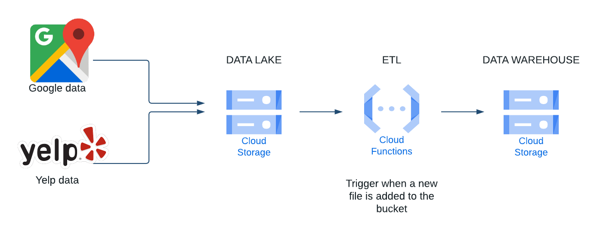

# **Data Processing**

One of the most important things on this project is the treatment and organization of the data. The following shows the data processing scheme. 

## Parts of the Process
[Data Lake](#Data-Lake)
 

[Technologies](#Technologies)

## Data Lake

The beginning part of this project is to upload raw data that was given to us and store it into our Data Lake.
 
**What is a Data Lake ?**
 
A Data Lake is a data storage system that allows large amounts of data to be stored in its native format, without the need for prior structuring, allowing faster and more flexible access to data. We are going to use Google Cloud Storage to store the raw data of Google & Yelp.
 
**Why Google Cloud Storage ?**
 
We choosed Google Cloud Services in general, because they have an amazing UI, very easy to use and very complete. Also and important fact is their competitive prices, We found no reason to don't Google Cloud Services.
 

## Cloud Functions

We used Google Cloud Functions for the task of extracting the data from the Data lake, transforming/cleaning it and loading it in our Data Warehouse, which will be explained in detail later.
 

## Data Warehouse

After cleaning the data and making all the transformations

 

## Technologies

* Google Cloud Plataform (GCP)
* Google Cloud Storage
* Google Cloud Function
* Google Big Query
* Pandas
* Python

